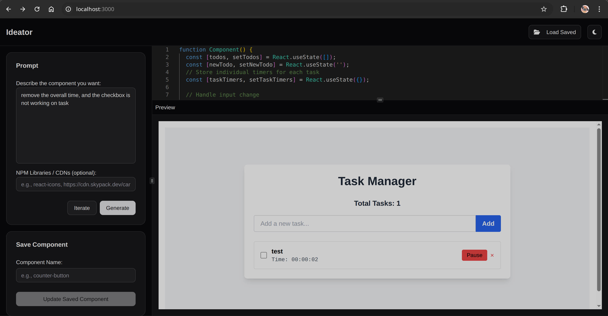

# Ideator - AI-Powered Component Generator



Ideator is a Next.js application that helps developers quickly generate React components using AI. Describe the component you need, and Ideator will generate the code for you, complete with preview functionality.

## Features

- **AI-Powered Generation**: Generate React components from natural language prompts
- **Code Editor**: Built-in Monaco editor for real-time code editing
- **Live Preview**: See your components render as you edit them
- **Component Management**: Save, load, and organize your generated components
- **Theme Support**: Light/dark mode toggle
- **Responsive Layout**: Adjustable panels for optimal workspace
- **Extensive UI Library**: Pre-configured with Radix UI and other popular component libraries

## Technology Stack

- **Framework**: Next.js 15
- **UI**: Radix UI, Tailwind CSS
- **Editor**: Monaco Editor
- **Database**: MongoDB (via Mongoose)
- **State Management**: React Hooks
- **Form Handling**: React Hook Form
- **Notifications**: Sonner
- **Theming**: next-themes

## Installation

1. Clone the repository:
```bash
git clone https://github.com/yourusername/v0-clone.git
```

2. Install dependencies:
```bash
npm install
```

3. Set up environment variables:
```bash
cp .env.example .env.local
```

4. Start the development server:
```bash
npm run dev
```

## Usage

1. Describe the component you want in the prompt area
2. Optionally specify any NPM libraries or CDNs to include
3. Click "Generate" to create your component
4. Edit the code directly in the built-in editor
5. Use "Iterate" to refine your component based on new prompts
6. Save your components for later use

## API Endpoints

- `POST /api/generate` - Generate component code
  - Body: { prompt: string, libraries?: string, existingCode?: string }

- `GET /api/components` - List saved components
- `POST /api/components` - Save new component
- `PUT /api/components/:id` - Update existing component
- `DELETE /api/components/:id` - Delete component

## Roadmap

- [ ] Add component sharing functionality
- [ ] Implement version history for components
- [ ] Add more template examples
- [ ] Support for additional frameworks (Vue, Svelte)
- [ ] Component testing integration

## Contributing

Pull requests are welcome. For major changes, please open an issue first to discuss what you would like to change.

## License

[MIT](https://choosealicense.com/licenses/mit/)
